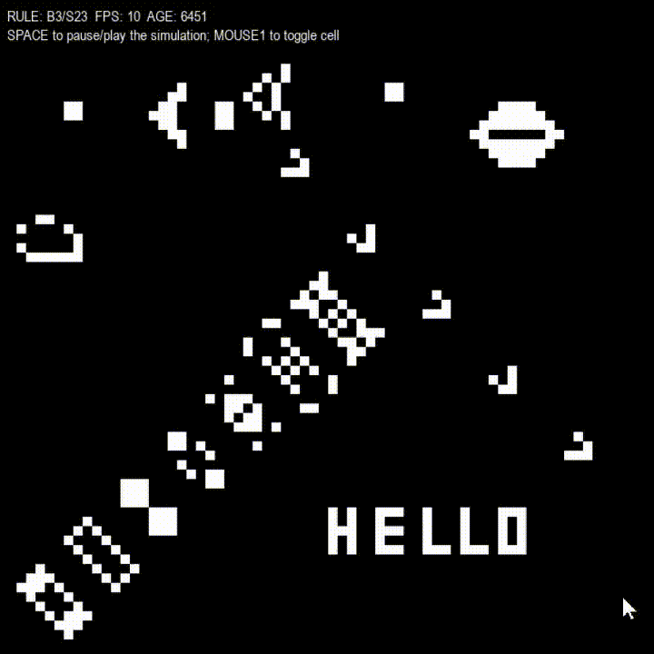

# Emergent Behaviour
A collection of graphics simulations that showcase how simple rules can be used to form complex emergent behaviour.

Each example can be run using the `main.py` file in its corresponding folder. Constants can be changed in `config.py`.

[Pygame](https://github.com/pygame/pygame) must be installed (`pip install pygame`)

## Life
[Conway's Game of Life](https://en.wikipedia.org/wiki/Conway%27s_Game_of_Life) is a grid-based cellular automaton that evolves over time based on simple rules. The standard rules are as follows:
- A dead cell with 3 alive neighbors is reborn
- An alive cell with 2 or 3 alive neighbors survives
- All other cells die
At each iteration, these rules are applied across all cells simultaneously.

Use `SPACE` to pause/play the simulation and `MOUSE1` to toggle cells while paused.

## Boids
[Boids](https://en.wikipedia.org/wiki/Boids) (bird-oids) is a simulation that models the flocking behavior of birds by applying three basic rules: 
- Separation (avoiding collisions)
- Alignment (matching the direction of nearby boids)
- Cohesion (moving toward the average position of nearby boids)

This results in realistic flocking motion.

Use `MOUSE1` to steer boids towards your mouse.

## Ants (work in progress, not functional)
[Ant Colony Simulations](https://softologyblog.wordpress.com/2020/03/21/ant-colony-simulations/) model how ants forage for food, and bring it back to their nests using only pheromone trails for navigation.

Two different pheromone types are used:
- A foraging pheromone excreted when the ant is searching for food
- A retreating pheromone excreted when the ant is bringing food back to the nest

While foraging, the ant moves in the direction with the greatest density of retreating pheromone, and while retreating, the foraging pheromone.

The pheromones are blurred each iteration to simulate the diffusion of pheromones as they would in a real-life environment.
